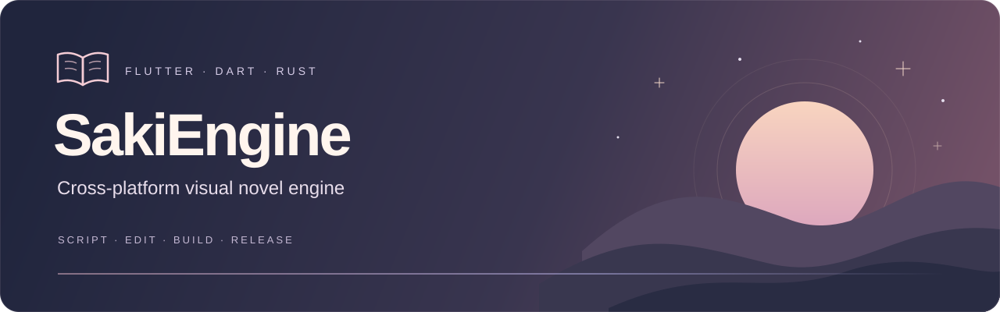

<p align="center">
  
</p>

<h1 align="center">SakiEngine</h1>

<p align="center">
  <b>Flutter 製のクロスプラットフォーム・ビジュアルノベルエンジン</b><br>
  SKS スクリプト · ビジュアル演出編集 · 多言語対応 · マルチプラットフォーム出力<br>
  Windows · macOS · Linux · Android · iOS · Web
</p>

<p align="center">
  <a href="https://flutter.dev"></a>
  <a href="https://dart.dev"></a>
  <a href="Engine/packages/saki_native"></a>
  <a href="LICENSE"></a>
  <a href="https://github.com/AimesSoft/SakiEngine/commits/main"></a>
</p>

<p align="center">
  <a href="README.md">简体中文</a> · <a href="README.en.md">English</a> · <b>日本語</b>
</p>

<p align="center">
  <a href="#quick-start">クイックスタート</a> ·
  <a href="#features">主な機能</a> ·
  <a href="#launcher">ランチャー</a> ·
  <a href="#shortcuts">ショートカット</a> ·
  <a href="#build">配布モード</a> ·
  <a href="docs/script-guide.md">スクリプトガイド（中文）</a> ·
  <a href="docs/development.md">開発と配布（中文）</a> ·
  <a href="https://github.com/AimesSoft/SakiEngine/issues">フィードバック</a>
</p>

---

## 概要

SakiEngine は **Flutter / Dart** 製のオープンソース・ビジュアルノベルエンジンです。**Windows、macOS、Linux、Android、iOS と Web** に対応しています。

`.sks` による会話・分岐・演出の記述に加え、音声、動画、多言語化、セーブ、ロールバックを備えています。GUI ランチャーでプロジェクトの作成・実行・パッケージ化を行い、内蔵エディターでゲーム実行中にスクリプトと演出を編集できます。画面や作品固有の処理は Flutter モジュールで拡張できます。

エンジン名 **Saki** は、『新世界より』（中国語題：『来自新世界』）の**渡辺早季（Saki Watanabe）**に由来します。

<a id="features"></a>

## 主な機能

| 分野 | 利用できる機能 |
| --- | --- |
| **シナリオと読書** | SKS の会話・選択肢・条件ジャンプ、通常 / NVL / シネマ形式のナレーション、オート・スキップ・履歴・ロールバック、`.sakisav` セーブと既読管理 |
| **キャラクターと演出** | 自動配置、ポーズ・表情・第2レイヤーの差分、CG、アニメーション WebP、場面転換、フィルター、マウス視差、プロジェクト独自のキャンバス |
| **音と映像** | BGM・効果音・ボイスの制御、Erika による動画再生、ループ・連続再生・透過動画の設定。対応範囲はプラットフォームによって異なります |
| **多言語制作** | 簡体字・繁体字中国語、英語、日本語を同じ行に記述。未翻訳時のフォールバック、翻訳エディター、単一言語のスクリプト表示 |
| **実行中の編集** | デスクトップの Debug / 演出モードで使えるスクリプト編集、差分プレビュー、キャンバス配置、開発者パネル。保存してすぐに再読み込み |
| **プロジェクト拡張** | ランチャーでのプロジェクト作成・管理、`ProjectCode` によるテーマ・画面・スクリプト拡張、設定タブの追加、Steam 実績の連携 |
| **実行と配布** | SKS の事前コンパイル、SakiPack リソースパッケージ、アセット索引・セーブ・スクリプト索引・履歴スナップショットなどを担当する Rust サービス |

各環境の SDK、署名要件、出力先は [開発と配布（中文）](docs/development.md) を参照してください。

<a id="launcher"></a>

## ランチャー

**SakiEngine Launcher** は、プロジェクト管理・実行・ビルド用のデスクトップアプリです。`Game/` 内のプロジェクトを一覧表示し、新規作成、既定の作品の選択、実行デバイスの選択、ログの確認、ビルドをひとつの画面で行えます。作成時には名前・Bundle ID・テーマカラーを指定でき、スクリプト、設定、素材ディレクトリ、`ProjectCode` パッケージが生成されます。

「実行設定」と「ビルドモード」は別々に選びます。

| 実行設定 | 用途 |
| --- | --- |
| **Debug** | エンジンや作品のコードを開発。Flutter のホットリロード・ホットリスタートと制作ツールを利用 |
| **演出モード / 演出模式** | Release 構成で動かしながらスクリプトの直接読み込み・再読み込みと制作ツールを保持。会話・差分・背景・音楽の調整に |
| **Profile** | 配布用のリソース処理を通して実行し、リリースに近い環境で性能を確認 |
| **Release** | 配布用のリソース処理を通して、プレイヤー向けの動作を確認 |

**内蔵コンソール**にはログ表示、Debug のホットリロード / リスタート、安全な再起動、終了、ログのコピーがあります。**システム端末**では Flutter の `r` / `R` / `q` を使えます。Profile / Release の配布用リソースを使う実行には内蔵コンソールが必要です。ビルドは「配布モード」と「演出モード」から選べ、完了後に ZIP を作成して出力先を開きます。違いは [配布モード](#build) をご覧ください。

<a id="quick-start"></a>

## クイックスタート

Git と対象プラットフォームの開発環境を用意してください。ネイティブ版ゲームのビルドには **Rust / rustup** も必要です。現在のランチャーとデモには、**Dart 3.10.4 以上・4.0.0 未満**を含む Flutter が必要です。

```bash
git clone https://github.com/AimesSoft/SakiEngine.git
cd SakiEngine
```

**Windows · PowerShell**

```powershell
.\saki.bat
```

**macOS / Linux**

```bash
./saki.sh
```

起動スクリプトは既存の Node.js / Flutter を優先し、見つからなければリポジトリ内にダウンロードします。Rust、システムコンパイラー、各プラットフォームの SDK は別途必要で、古い Flutter の自動更新も行いません。Windows では Visual Studio の「C++ によるデスクトップ開発」、macOS / iOS では Xcode と必要に応じて CocoaPods、Android では SDK / JDK / NDK、Linux では Flutter デスクトップ用のビルド依存と GStreamer 関連の音声依存を用意します。詳細は [環境構築（中文）](docs/development.md#准备环境) をご覧ください。

ランチャーで **SakiEngine** を選択してデモを実行するか、新規プロジェクトを作成します。デモの直接起動コマンド：

```powershell
# Windows
.\saki.bat SakiEngine
```

```bash
# macOS / Linux
./saki.sh SakiEngine
```

### SKS スクリプトの例

この例は、デモのキャラクター `yk` と背景 `bg school` を使います。SKS は Ren’Py の書き方を参考にしていますが、独自のパーサーとランタイムで動作します。

```sks
label start
scene bg school with dissolve
yk pose2 happy "選択肢による分岐のサンプルです。"

menu
"キャラクターのセリフ" dialogue_branch
"ナレーション" narration_branch
endmenu

label dialogue_branch
yk "キャラクターのセリフの分岐です。"
return

label narration_branch
"ナレーションの分岐です。"
return
```

[デモのスクリプト](Game/SakiEngine/GameScript/labels/start.sks) や [SKS ガイド（中文）](docs/script-guide.md) も参考にしてください。

### スクリプトの多言語化

```sks
yk "/zhs 你好。/ /zhc 你好。/ /en Hello./ /jp こんにちは。/"
```

会話・選択肢・キャラクターの表示名に言語別のテキストを記述できます。翻訳がない場合は `script_default_language` に従ってフォールバックします。`"こんにちは。 /en Hello./"` のように少しずつ追加することもできます。この場合、プロジェクトの `GameScript/configs/configs.sks` に `script_default_language: jp` を設定してください。日本語のスクリプトタグは `jp` です。

<a id="build"></a>

## ビルドと配布モード

ランチャーには2つのビルドモードがあります。どちらも Release の実行プログラムを生成しますが、素材の配置と制作ツールの扱いが異なります。

| 項目 | 配布モード | 演出モード |
| --- | --- | --- |
| 用途 | 完成した作品をプレイヤーに配布 | ライター・演出担当・テスターが作品を調整 |
| シナリオ | SKS を Dart に事前コンパイルして実行 | 事前コンパイルを省略し、スクリプトの直接読み込みと再読み込みを保持 |
| 素材 | ネイティブ版は `game.sakipak` を生成。Web はブラウザーから読める素材を保持 | デスクトップ版には外部の `Game/<作品>/Assets` と `GameScript*` を同梱 |
| 制作ツール | 無効。`console` のログ表示は利用可能 | 有効。演出用ショートカットも利用可能 |
| パッケージ | 作品名・バージョン・日付を含む ZIP を自動作成 | 同じ形式の ZIP に `-showcase` を付加 |

デスクトップの演出モードでは、実行プログラムを再コンパイルせずにスクリプトや素材を変更できます。Dart コードの変更には再ビルドが必要です。配布時はランチャーで **ビルドモード → 配布モード（发布模式）→ ビルド対象 → 发布构建** を選びます。完了すると出力フォルダーが開きます。

ランチャーでビルド先を選ぶか、インストール済みの Node.js で実行します：

```bash
node tool/saki_cli.js build
# 例：Windows 上でデモをビルド
node tool/saki_cli.js build SakiEngine windows
```

| プラットフォーム | 配布方法 |
| --- | --- |
| Windows | デスクトップアプリ。Windows 上のビルド、または macOS からのクロスビルド |
| macOS | Flutter / Xcode でビルドする macOS アプリ |
| Linux | デスクトップアプリ。Linux 上のビルド、または macOS からのクロスビルド |
| Android | 現在のスクリプトは ARM64 APK を生成 |
| iOS | macOS 上でビルド。現在は署名なしのため、配布時に署名を行う |
| Web | `build/web` に静的サイトを生成。Web サーバーに配置してブラウザーでプレイ |
| macOS → Windows / Linux | x64 のクロスビルド経路。Flutter SDK・ターゲットパック・ネイティブプラグイン構成の一致が必要 |

出力は `Game/<作品>/build/` 配下です。ランチャーの ZIP は対象の出力フォルダーの親ディレクトリに作成されます。CLI の `build` は配布用の処理を使い、演出モードのビルドと自動 ZIP 作成には Launcher を使います。クロスビルドの [マニフェスト](toolchains/cross/manifest.json) は現在 **Flutter 3.44.0** に固定されています。古いパックや異なるプラグイン構成は拒否され、再生成が必要です。

独立したゲームリポジトリ用の CI テンプレートは、まだ Flutter **3.35.1** を指定しており、現在のデモの Dart 要件を満たしません。配布に使う前に更新と検証を行ってください。出力先・パッケージ・CI の詳細は [開発と配布（中文）](docs/development.md) にまとめています。

<a id="shortcuts"></a>

## ショートカットと操作

### 読書と共通操作

| 操作 | 機能 |
| --- | --- |
| `Enter` / `Space` / 下矢印キー / 下スクロール | セリフを全文表示、または物語を進める |
| 上矢印キー / 上スクロール | 設定に応じてロールバック、または履歴を開く |
| `Ctrl` / `Command` を押し続ける | 強制スキップ。離すと停止 |
| 右クリック | ゲーム UI の非表示 / 再表示。対応するオーバーレイでは閉じる操作 |
| `Esc` | 現在の制作ツールや対応するオーバーレイを閉じる |
| `console` と順に入力 | ログパネルを開く。配布版でも利用可能。修飾キーを押さず、各キーの間隔は3秒以内 |

### 制作と演出

以下は **デスクトップの Debug / 演出モード**で利用できます。ゲームウィンドウにフォーカスを当ててください。テキスト編集中は入力を妨げるグローバルショートカットを抑制します。

| ショートカット | ツール |
| --- | --- |
| `Shift + R` | 現在のスクリプトを再読み込みし、ディスク上のシナリオや素材の変更を反映 |
| `Shift + A` | 表情 / ポーズのホイール。選択後に Shift を離して適用 |
| `Shift + C` | 現在のセリフの話者 / ナレーターを選ぶホイール。Shift を離して適用 |
| `Shift + B` | 背景グリッド。プレビュー後にダブルクリックで適用 |
| `Shift + 1` | 音楽グリッド。試聴後にダブルクリックで適用 |
| `Shift + V` | キャンバスグリッド。プレビュー後にダブルクリックで配置 |
| `Shift + E` | 基本表情と第2レイヤーを別々に確認できる差分セレクター |
| `Shift + D` | 開発者パネル |
| `Shift + P` | 全ソース / 単一言語表示に対応したスクリプトエディター |
| `Shift + L` | 会話とキャラクター名の翻訳エディター |

背景・音楽・キャンバスのグリッドは Shift を離しても開いたままです。同じショートカットか `Esc` で閉じます。ホイールは Shift を離すと適用します。`GameModule.debugCommandMenus` で作品独自の Shift ショートカットも登録できます。`Shift + R` はゲームスクリプトの再読み込みで、Flutter 端末の `r`（ホットリロード）や `R`（ホットリスタート）とは異なります。

<details>
<summary>エディター内のショートカット一覧</summary>

`Mod` は Windows / Linux では `Ctrl`、macOS では `Command` です。

| ショートカット | 機能 |
| --- | --- |
| `Mod + S` | 保存と再読み込み。スクリプト・翻訳エディターで利用可能 |
| `Mod + W` / `Esc` | エディターを閉じる。スクリプトの Esc は検索バーを先に閉じ、翻訳エディターは未保存の変更を確認 |
| `Mod + F` | スクリプトの検索バーを開く |
| `Mod + G` / `F3` | 次の検索結果へ。検索バーが閉じている場合は開く |
| `Mod + Shift + G` / `Shift + F3` | 前の検索結果へ |
| `Mod + /` | 選択したスクリプト行のコメントを切り替え |
| `Mod + Z` | スクリプト編集を元に戻す |
| `Mod + Shift + Z` / `Mod + Y` | スクリプト編集をやり直す |
| `Mod + A` / `C` / `X` / `V` | 全選択 / コピー / 切り取り / 貼り付け |

保存前に外部エディターによる変更を確認します。競合があれば下書きを保持し、解決を促します。

</details>

<a id="showcase"></a>

## スクリーンショット

<table>
  <tr>
    <td width="50%"></td>
    <td width="50%"></td>
  </tr>
  <tr>
    <td align="center">メインメニュー</td>
    <td align="center">立ち絵と会話</td>
  </tr>
  <tr>
    <td width="50%"></td>
    <td width="50%"></td>
  </tr>
  <tr>
    <td align="center">会話履歴</td>
    <td align="center">確認ダイアログ</td>
  </tr>
</table>

<p align="center"><sub>リポジトリに保存されている作品のスクリーンショットです。画面はプロジェクトのテーマやモジュールによって変わります。</sub></p>

<a id="explore"></a>

## ドキュメントとサンプル

| 入口 | 内容 |
| --- | --- |
| [SKS ガイド（中文）](docs/script-guide.md) | シーン、差分、アニメーション、キャンバス、文字効果、場面転換、多言語化 |
| [開発と配布（中文）](docs/development.md) | ツールチェーン、CLI、構成、モジュール、SakiPack、ビルド |
| [デモプロジェクト](Game/SakiEngine) | リポジトリに同梱された編集可能なプロジェクト |
| [SoraNoUta / 空之歌](https://store.steampowered.com/app/3536120/) | SakiEngine 製のゲーム。Steam で配信中 · [ソースコード](https://github.com/MCDFsteve/SoraNoUta-SakiEngine) |
| [VS Code 拡張](vscode-sakiengine-syntax) | SKS の構文強調。「VSIX からのインストール」でディレクトリ内の最新 `.vsix` を選択 |
| [Rust ネイティブサービス（English）](Engine/packages/saki_native/README.md) | アセット・スクリプト索引、セーブ、履歴スナップショット、既読管理 |

## フィードバックと貢献

不具合、機能要望、翻訳の修正は [Issues](https://github.com/AimesSoft/SakiEngine/issues) に、コードやドキュメントの変更は Pull Request で提出してください。不具合の報告には OS、起動コマンド、再現手順、関連ログを記載してください。

## ライセンス

エンジンのコードは [MIT License](LICENSE) で公開しています。外部依存とゲーム素材にはそれぞれのライセンスが適用されるため、作品の配布時には個別の許諾も確認してください。
