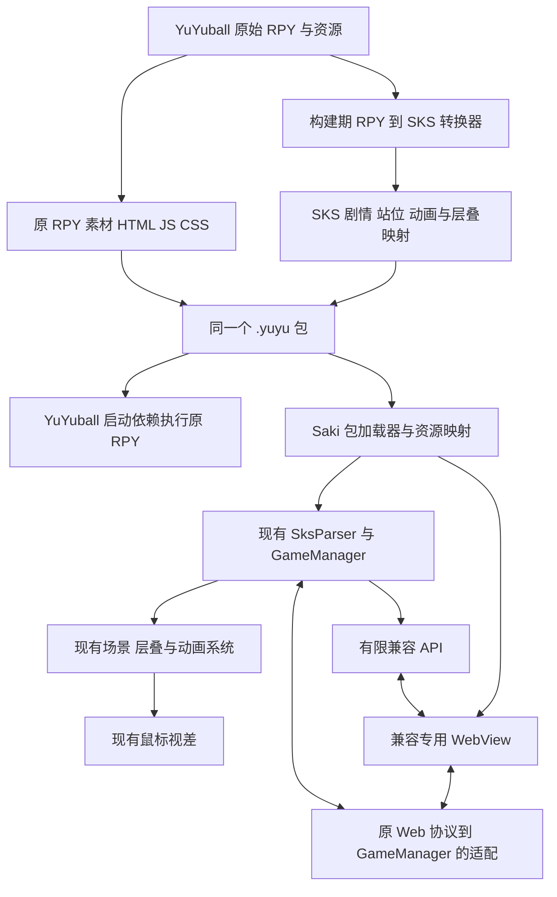

# YuYuball `.yuyu` 分发与 RPY → SKS 映射兼容实现设计

文档日期：2026-09-08。状态：首版映射、双内容包链路、条件层叠及六模式 NVL 映射已落地；启动器桌面编译提供默认不勾选的“编译 .yuyu”选项，未勾选时保持原有发行格式，NightBoat 原引擎发行链路已打通。全游戏 Saki 忠实兼容尚未完成，原引擎发行包保留未支持映射报告并明确拒绝在 Saki 运行。当前代码、命令和验收结果见 [实现记录](yuyu-implementation-status.md)。

本文采用**构建时将 `.rpy` 映射为 `.sks`，运行时复用 SakiEngine** 的方案。下文保留完整设计及最初只读审计；其中“本次只修改文档”“尚未实现”等表述描述设计阶段，不代表当前实现进度。未被实现记录明确列为已交付的接口、协议字段和拟新增语法仍为设计草案，P0～P5 的完成标准继续有效。

难度结论：普通剧情、站位和常见顺序动画的映射约为 **3～4/10**；把当前游戏的全部演出、Web UI、快进、回滚与读档行为对齐，约为 **6～7/10**。这是依据本地源码作出的工程判断，不是已完成实现的测量结果。相近的脚本结构可以显著减少转换工作，动画执行和恢复语义仍需逐项校准，详见第 15 节。

## 1. 目标与实现边界

YuYuball 发布产物拆成**平台启动依赖 + 一个 `.yuyu` 游戏包**。包中保留原始剧情、layeredimage、transform/ATL、素材和 HTML/JS/CSS，同时收录自动生成的 SKS 剧情、角色/站位/动画配置及抽象映射表。

同一个包具有两条执行路径：YuYuball 使用原 `.rpy`，SakiEngine 使用包内生成的 `.sks`。作者仍以现有 YuYuball 工程为源，不需要人工维护第二份剧本；玩家打开包即可运行，不为每个游戏重新编译播放器。

确定采用以下分工：

- **剧情和演出映射到 SKS**，由现有 `SksParser`、`GameManager` 和场景渲染系统执行。
- **静态 transform 映射到站位，顺序 ATL 映射到动画关键帧**。对曲线、等待、循环和继承的差异增加有限的兼容配置/通用动画能力。
- **立绘复用 Saki 层叠系统**，导出资源别名、组合表达式和必要的条件选择规则。
- **鼠标视差复用 Saki 现有组件**，适配参数和来自 WebView 的指针输入。
- **Web UI 使用兼容专用 WebView**，运行包内原 HTML/JS/CSS；桥接到同一个 GameManager。
- **特殊行为使用有明确职责的兼容 API 或 SKS 节点**，例如参数化转场、网页效果、额外音频通道。

兼容模块负责装载、资源和 API 适配，不另建剧情 VM、完整 ATL 解释器或一整套平行场景系统。转换器内部可使用临时 AST/分析结构，发布执行载荷以 SKS 和 Saki 配置为主，不再定义通用 portable 程序字节码。

### 1.1 忠实映射的完成标准

对一个声明可兼容的游戏，所有需要运行的剧情和演出都必须有映射，正常播放、换表情、转场、快进、回滚和读档后的行为应与原版对照一致。无法表达的内容必须补齐适配或阻止该包发布，不能静默丢弃或自动替换成“相似效果”。

先以当前项目实际使用的功能建立完整映射，再逐步覆盖 YuYuball 其他行为。新增功能时同时维护转换规则与 Saki 对应能力。支持范围由版本化映射 profile 和实际能力表描述；“该游戏完整通过”与“任意 Ren’Py/Python 游戏均支持”是不同的结论。

这一路线允许改进 Saki 通用原语，但每一项应服务于具体可验证的演出。若某段内容只有再造完整解释器才能支持，应报告为未覆盖项，重新评估转换方法，不把第二套 VM 藏进一个 `api yuyu.execute` 调用。

## 2. 本地源码基线与现状

### 2.1 首次审计与本次修订版本

| 项目 | 本地根目录 | 首次审计 Git HEAD / 版本 | 首次审计工作区情况 |
|---|---|---|---|
| YuYuball | `/Library/Afolder/RenpyProject/YuYuball` | `5e31f81ae73aa6455cd262c9b4ecc6cdba568de5` | NightBoat 第 16 章存在修改，另有未跟踪的文档和素材；本次未触碰 |
| YuYuball 内置 Ren’Py | 同上，`RenpyEngine/engine_core/renpy` | `8.4.1.25072401`，Tomorrowland | 以改造后的本地源码为准 |
| SakiEngine | `/Library/Afolder/FlutterProject/SakiEngine` | `c1ad8c751be0a49c23f814397f17e8f53646bcef` | 本次工作开始时工作区干净 |

本文基于 **HEAD 加当时工作区内容**，不是纯提交快照。真正制作兼容基线时，应另外保存输入文件清单及 SHA-256，不能仅凭上述 HEAD 复现 NightBoat 当前内容。

映射方案修订时，仓库 HEAD 已分别为 YuYuball `021d6c3e0c8249bb1779aac2f8795e1b0d4ece13`、SakiEngine `5892b3fecdd0bf76b45b1479369f844e2d11dec6`。本次重新核对了文中列出的 Saki 解析、层叠、API 和缩放入口；下面的全项目数量保留为首次审计结果，没有把它们冒充新版本的完整审计。本次文档操作没有修改这些提交或引擎代码。

未找到上述仓库及适用父目录中的 `AGENTS.md`。部分剧情文件带有生成器标记且保留人工演出修改，当前 `.rpy` 是审计对象；本文不运行生成器，不用上游转换结果覆盖现有脚本。

### 2.2 已确认的实现事实

| 能力 | YuYuball 现状 | SakiEngine 现状 | 对设计的影响 |
|---|---|---|---|
| 发布打包 | Launcher 的 `Distributor` 分类文件，`archive_files` 生成 `.rpa`，再组合平台发行包 | `scripts/build.js` 预编译 SKS 为 Dart，另生成 `game.sakipak` | 增加新的内容包出口和运行入口，不能只改后缀 |
| 启动 | Rust Launcher 查找平台 Runtime，再启动 `engine_core` | Flutter 游戏入口、项目模块及资源初始化 | 两边各增加 `.yuyu` 入口 |
| 渲染 | `display/core.py` 当前选择 wgpu，Python `wgpudraw.py` 对接 Rust 原生库 | Flutter 场景/角色组件及效果 | 对照基准必须使用本地 YuYuball 渲染行为 |
| 动画 | 完整 Ren’Py ATL 执行结构及项目 Motion/WebWith 扩展 | `AnimationManager` 主要是属性偏移关键帧，现有控制器使用 Flutter 曲线 | 映射为 Saki 关键帧，补齐曲线、等待、循环和继承差异 |
| 立绘 | 多属性 layeredimage、条件图层、自动光照、multiply 混合 | 已有角色/CG 层叠，支持 `+` 多层 expression 和 foreground | 复用层叠系统，生成资源别名和有限条件规则 |
| Web UI | 原生 `wry` 覆盖层，Python 本地 HTTP 服务与双向消息桥 | 本次搜索 Engine 未发现现成 YuYuball WebView 宿主 | 新增兼容专用 WebView，保留原网页 |
| 鼠标视差 | 层/tag/名称深度、最大偏移、反向与回正 | 已有 `MouseParallax`、`ParallaxAware`、设置开关 | 复用，做参数和输入适配 |
| 语音 | 剧情有独立 `voice` | 当前 AST 已有 `VoiceNode` / `StopVoiceNode` | 语音播放基础可复用，仍需核对通道生命周期 |
| 脚本预处理 | Ren’Py AST、Python 初始化及自定义语句 | Dart SKS AST 与运行时文本解析；Rust `scripts.rs` 提供扫描、引用诊断和合并 | 生成 SKS 后复用现有解析/执行路径 |

现有 SakiPack 的白名单不含 `.rpy`、`.html`、`.js`、`.css`，其固定目录/路径规则也不等同于 Ren’Py 游戏目录。`.yuyu` 应使用独立读取器，通过抽象资源接口接入已有资源能力。

### 2.3 已执行的只读审计

运行了迁移审计器和 Ren’Py 场景分析器，输入为 YuYuball 下的 `Games/NightBoat/game`。结果包含 60 个 `.rpy` 文件、40 个命名 transform、13 处 layeredimage 声明；场景分析器识别到 21 个带生成标记的文件。

这些是启发式扫描结果，不是完整 AST 覆盖证明。例如扫描器会把 Python 函数内的 `return` 计入特征，也可能把 `block=False` 识别为复杂 ATL。开发期需要用固定版本解析器重新建立精确能力清单。

已人工核实的代表场景包括：

- `pose_shake_at2`、`nb_head_shake_at2`、延迟启动的 `nb_head_shake_at7`、无限重复的 `nb_head_up_at4`。
- Yu Man 的身体、表情、光照叠层；同一 `dusk`/`night` 属性按服装条件选择不同 multiply 蒙版。
- `nb_squint_with`、`nb_body_jolt_with`、`nb_dialogue_shake_with`。
- `NightBoatWebMotionWith` 同时触发 Python Motion 转场和 JavaScript 效果。
- `nvl` 到 `nvl6` 的引擎扩展、网页打字机反馈、网页视频覆盖层。

没有执行游戏播放、构建或像素对照；本文不宣称这些效果已经在 SakiEngine 中兼容。

本次修订进一步核实：SKS 已支持 `jump <label> if <variable> <true|false>`；`ScriptMerger` 已有从资源接口读取并解析 SKS 文本的路径，外部 `.yuyu` 尚需资源适配；角色 `scale` 在已检查的呈现路径中按舞台高度计算，须与 RPY zoom 做尺寸换算。

## 3. 总体架构



构建时解决语法、符号、单位和可确定的结构差异；运行时只处理剩余的状态变化、动画和交互。所有兼容 API 都由 SKS 执行顺序驱动，不自行接管整个剧情。

同包中的源脚本和生成 SKS 属于同一次输入快照，校验与验收报告绑定最终包哈希。保留原 RPY 执行作为独立基准，防止两边同时消费错误转换结果却得到虚假的一致。

## 4. `.yuyu` 包规范

### 4.1 内容布局

建议继续采用 ZIP64 容器。包格式负责索引、版本和内容完整性；兼容执行格式改为 SKS。

```text
NightBoat.yuyu
├── manifest.json
├── index.json
├── game/                              # 原游戏目录，保持结构
│   ├── codes/story/*.rpy
│   ├── codes/characters/*.rpy          # layeredimage、transform/ATL
│   ├── codes/cg/*.rpy
│   ├── codes/configs/*.rpy
│   ├── codes/screens/*.rpy
│   ├── assets/images/ music/ sound/ fonts/ ...
│   └── assets/web_overlay/            # 原 HTML/JS/CSS 及网页资源
├── saki/
│   └── GameScript/
│       ├── labels/*.sks               # 自动生成的完整剧情
│       └── configs/
│           ├── characters.sks
│           ├── poses.sks
│           └── animation.sks
├── mappings/
│   ├── symbols.json                   # 源名字到 SKS 别名/label/动画
│   ├── assets.json                    # Saki 虚拟资源名到原素材 entry
│   ├── layers.json                    # 层叠组合与必要的条件规则
│   ├── animations.json                # 单位/曲线/profile 元数据
│   ├── effects.json                   # 兼容 API 的有限效果描述
│   ├── web-bridge.json                # 原网页消息及数据字段
│   ├── state.json                     # 兼容扩展状态 schema
│   └── source-map.json                # 生成 SKS 到原 RPY 的位置
├── reports/mapping-coverage.json       # 完整性与未处理项报告
└── licenses/
```

素材默认只保存一份，Saki 所需命名通过虚拟别名映射到 `game/` 中的原文件。只有确实需要且已验证的派生素材才另外生成。一个原 RPY 同时包含立绘和 ATL 没有问题，由转换器分别输出配置。

原文件和生成文件不可人工双向编辑：RPY 是来源，SKS 是可审阅的构建产物；重新导出应可复现。原剧情带生成器标记也不意味着发布构建可以重跑并覆盖人工修改。

### 4.2 Manifest 示例

以下为局部结构示意，profile、capability 和游戏 ID 均为设计值。不是已存在的包或可直接发布的完整清单。

```json
{
  "format": "yuyu",
  "formatVersion": { "major": 1, "minor": 0 },
  "game": { "id": "org.yuyuball.nightboat", "name": "Night Voyage", "version": "0.1.0" },
  "sourceRuntime": {
    "engine": "yuyuball",
    "revision": "021d6c3e0c8249bb1779aac2f8795e1b0d4ece13",
    "renpyVersion": "8.4.1.25072401",
    "root": "game"
  },
  "compatibility": {
    "method": "rpy-to-sks",
    "mappingProfile": "yuyuball-to-sks-v1",
    "status": "mapping-validated",
    "scriptRoot": "saki/GameScript",
    "entryLabel": "start",
    "animationProfile": "yuyuball-v1",
    "requiredCapabilities": [
      "sks.core@1",
      "sks.animation.yuyuball@1",
      "sks.api.yuyu-effects@1",
      "ui.yuyuball-web@1"
    ]
  },
  "stage": { "width": 1280, "height": 720, "viewportProfile": "yuyuball-fit-v1" },
  "web": { "entry": "game/assets/web_overlay/index.html", "bridgeProfile": "yuyuball-web-v1" },
  "contentIndex": "index.json",
  "stateSchemaVersion": 1
}
```

发布器还必须填入实际的输入快照摘要、转换器版本、规则摘要、索引 SHA-256 和目标能力版本。`mapping-validated` 仅表示转换闭包与目标解析检查通过，实际一致性由最终包哈希关联的运行验收报告证明。

`game.id` 保持稳定，不随文件名/显示名改变；它负责设置和存档命名空间。profile 明确目标 SKS 语法及动画行为，加载器在剧情开始前检查当前播放器是否支持全部必需能力。

### 4.3 索引、路径与缓存

- entry 用 UTF-8 和 `/`，保留原文件名；拒绝重复条目、大小写折叠/Unicode 规范化后的冲突、绝对路径、`..` 和软链接。
- 索引记录每个载荷 entry 的长度、SHA-256 和用途；ZIP 提供归档偏移，避免两个偏移表冲突。
- 索引不包含自身与 manifest，manifest 保存索引哈希，完整包哈希由外部验收/发行清单记录，避免循环哈希。
- 文本压缩；已压缩媒体优先 Store，便于 Range/按需物化。压缩和哈希不代表加密或可信发布者认证。
- 固定条目顺序、时间戳、压缩器和参数，保证确定性构建。
- 包只读，缓存/存档写入用户目录；读取器校验越界、重复 entry 和异常解压大小。

原网页的相对路径必须保持。静态分析还应检查 CSS 导入、JS 模块、字体和视频；动态资源名需明确依赖集合或保留相应目录，不能只收集一次运行中加载过的文件。

SakiPack 当前不收集 RPY/HTML/JS/CSS，不能直接改后缀使用。新增 `.yuyu` reader，再将虚拟资源接口接入现有 AssetManager。

## 5. YuYuball 构建与启动流程

### 5.1 构建步骤

1. 冻结当前 RPY、素材、配置和引擎/规则版本，生成输入快照；所有输出写入独立 staging 目录。
2. 使用固定版 Ren’Py parser 分析源码，识别 init 顺序、符号、标签、控制流、layeredimage、命名/内联 ATL 及项目扩展。
3. 建立映射账本：直接 SKS、配置转换、兼容 API/有限节点、尚未支持。每个源构造有位置与处置。
4. 输出 SKS 剧情和 characters/poses/animation 配置；导出资源别名、效果参数、状态和 source map。
5. 用目标版本 SksParser/配置解析器严格检查生成物，核对每个源语句的预期输出节点、label、资源、动画和 API。
6. 生成资源闭包、manifest、索引及覆盖报告，封装 `.yuyu`；再组合平台启动依赖。
7. 从最终包分别运行原 RPY 与生成 SKS，对照通过后发布。构建失败不覆盖上一份可用发行物。

转换器可以做确定性的 init/资源工厂求值，但不能把整个游戏启动一次获得的执行轨迹当成完整脚本转换。动态函数和分支仍须按第 6 节处理。

### 5.2 启动依赖与原引擎读取

```text
发行目录
├── 游戏启动入口 / macOS App
├── 平台 Runtime 依赖
│   ├── Python、Ren’Py、engine_core
│   ├── native_wgpu
│   └── native_overlay / WebView 宿主依赖
└── Game.yuyu
```

平台启动依赖包含实际运行所需的引擎与原生库；`.yuyu` 游戏内容包跨平台复用。macOS 可在签名时把包放入确定的 Resources 位置。

第一期 YuYuball 校验后将 `game/` 物化到包哈希命名的目录，在 bootstrap 的脚本扫描之前设定游戏目录，再执行原 RPY。原 Web 静态服务根指向物化的网页目录。

编译缓存按包哈希和 Runtime ABI 隔离；若 Ren’Py 必须在源码旁写 `.rpyc`，使用隔离的执行副本，不能修改共享只读内容缓存。后续可以接入 loader/script 的包内枚举以减少解包；普通 Python 文件 IO 仍须单独适配。

包开发阶段可以标记 `status=incomplete`，用于先验证 YuYuball 的打包路径。SakiEngine 应明确拒绝或进入诊断模式，不能跳过未转换内容继续游戏。最终双引擎发行门槛要求当前游戏全部必需内容映射完成。

## 6. 剧情、语句和抽象映射

### 6.1 四类转换规则

| 分类 | 做法 | 例子 |
|---|---|---|
| 直接映射 | 输出现有 SKS 指令并核对语义 | 普通对白、jump、菜单、数值 pause |
| 配置映射 | 解析定义后输出 Saki 配置/资源别名 | 静态 transform、顺序 ATL、普通层叠组合 |
| 有限扩展 | SKS 调用明确的 API 或新增小型节点 | 参数化转场、WebWith、音频队列 |
| 尚未支持 | 给出源位置、原因和所需能力，阻止完整发布 | 未识别 Python、自定义渲染函数 |

转换器内部按 AST 工作，不用整段文本替换。已有 SKS 的拼写相似不代表可以把源行直接透传；尤其要检查当前解析器是否产生了预期节点。

### 6.2 语句映射表

| RPY | SKS / 配置 / API | 约束 |
|---|---|---|
| label、jump | 原生 label、jump | 标识符规范化和全局唯一映射 |
| 普通对白/旁白 | 原生对白 | 保留文本、说话者、转义、插值和文本标签含义 |
| menu | 原生 menu/endmenu + 跳转标签 | 选项块展开为明确 label；条件选项另做映射 |
| scene | 原生 scene + 背景别名 | 核对清场、图层和转场边界 |
| show / hide | 原生 show / hide | 映射 tag 到渲染槽、属性组合；核对离场/替换行为 |
| 静态 transform | `poses.sks` | 转换缩放/锚点/单位，不照抄数值 |
| 顺序 ATL | `animation.sks`，故事使用 `an` | 曲线/profile、hold、循环与继承见第 7 节 |
| layeredimage | characters、资源别名、组合 expression、规则表 | 保留多层顺序和属性条件 |
| play/stop music、sound、voice | 已有对应节点 | 仅在通道、循环和时序相同时直接映射 |
| fade、队列、额外音频参数 | `api yuyu.audio ...`（拟新增） | 结构化 cue，避免参数被解析成文件名 |
| with / with None | 匹配的原生效果或 `api yuyu.transition ...`（拟新增） | 保留批量场景提交和精确参数 |
| CustomWith | `api yuyu.webwith ...`（拟新增） | 保留原 JS 与 enter/finish/exit/skip |
| 数值 pause | 原生 pause | 检查是否可点击中断/快进；hard/无时限等待需补能力 |
| 简单布尔赋值/条件跳转 | 原生 bool、`jump <label> if <var> <true|false>` | 只有变量寿命与当前存储语义相同才直接用 |
| nvl / nvl2～nvl6 | 匹配的 NVL 节点及 Web 模式 API | 布局/累计规则不同的模式明确适配 |

### 6.3 控制流与 Python

普通流程由 SKS label/jump/menu 驱动，不另做控制流 VM。

- **静态、非递归 call**：可以按调用点展开/克隆被调用块，重命名内部 label，将每个 return 改为该调用点的后继 label。需要保留参数、局部作用域和返回值；无法证明这些条件时不可盲目展开。共用子过程较多时评估为现有 SKS AST/GameManager 增加小型 call/return 能力，并同步保存调用栈，而非新建解释器。
- **条件分支**：简单布尔条件转为现有条件 jump；复杂比较先由明确的状态操作生成条件结果，或为 SKS 增加范围有限的条件节点。当前 API 结果只有 nextState/waitDuration/stateAfterWait，没有任意跳转返回值，不能假设一个 API 已能随意控制程序计数器。
- **变量寿命**：原 `default` 的剧情变量不能都改成当前全局 bool 存储。剧情临时/可回滚变量进入 GameState 的兼容扩展数据；persistent、设置另存。
- **Python 常量和资源注册**：确定性工厂在构建时展开为配置/资源映射，保留初始化优先级和覆盖顺序。
- **项目函数/回调**：按功能展开为 SKS 或有单一职责的注册 API，例如更新光照、展示网页电影、解锁成就。
- **不可分析的任意 Python**：报告未覆盖；为实际需要的功能补转换规则。包内不携带需要动态编译的 Dart，不在 Saki 中运行任意 Python 字符串。

有限扩展的判断标准：参数和结果明确、状态可保存、正常/快进/回滚可测试。不能把所有剧情放进 `effects.json`，再用一个万能 API 循环解释；那会失去本方案复用 SKS 的意义。

### 6.4 映射文件的职责

| 文件 | 内容 |
|---|---|
| symbols | 原角色/image tag/label/transform 到生成别名，原定义与初始化顺序 |
| assets | Saki 查找名到原包 entry，尺寸、原画布和必要的派生资源 |
| layers | 原属性集合到 Saki pose/expression 或显式层列表，以及有限条件选择规则 |
| animations | 每个动画的源 transform、基础姿势、坐标换算、曲线/profile、继承策略 |
| effects | 已实现 API 可消费的参数/资源，不能是任意程序 |
| state | 兼容扩展字段、默认值、寿命、序列化和版本迁移 |
| web-bridge | 原消息种类、方向、字段及其 Saki 操作 |
| source-map | 生成文件/行/稳定节点 ID 到原 RPY 行与定义 |

生成节点 ID 不能只用行号；应以原语句锚点与映射记录支持版本定位。所有生成别名与资源映射一起导出，不能依靠“碰巧同名”查找。

### 6.5 生成 SKS 的严格检查

当前 parser/配置加载有未识别内容被跳过或缺资源回退的路径。转换流程必须额外检查：每个输入构造有处置、每段生成 SKS 产生预期节点数/类型、所有 label/pose/animation/API 存在、资源没有使用缺失回退。

新 API 也需维护能力表；当前原生 `api` 能解析不代表相应处理器已存在。新增节点或配置语法时同步修改运行解析、SKS→Dart 编译输出和状态序列化，使外部包路径与现有构建路径都接受同一目标规范。

## 7. ATL → Saki 动画映射

### 7.1 基本方法

将一个 transform 分解成：**基础姿势 + 动作关键帧 + 播放元数据**。静态部分输出到 `poses.sks`，动态部分输出到 `animation.sks`，故事输出 `at <pose> an <animation>`。所有动作继续由 Saki 现有角色/场景动画控制器驱动。

转换时保留源属性的绝对/相对类型，计算 Saki 相对最初基础姿势的目标偏移。已经是源 `xoffset` 目标的值不能逐段累加；没有在后续帧指定的属性应延续原状态。

### 7.2 必须做的单位换算

本地 `PoseConfig.scale` 在角色路径中表示渲染高度相对视口高度的比例，Ren’Py `zoom` 是对源显示对象尺寸的倍率，二者不能直接等号。

对于未裁剪、未额外缩放且合成画布一致的普通立绘：

```text
W, H = 源游戏逻辑画布尺寸
Hs   = 源立绘/合成对象的逻辑高度
z    = Ren’Py zoom
Saki scale = Hs * z / H
Δxcenter   = 源画布水平位移 / W
Δycenter   = 源画布垂直位移 / H
```

若存在 crop、其他 transform、独立 x/y 缩放或不同包围盒，需要先求源最终几何关系，再映射到 Saki 可表达参数。公式不能不加条件用于全部显示对象。

定位和像素位移在固定逻辑舞台计算，最后统一适配窗口，避免重复缩放。RPY `xpos 1` 与 `xpos 1.0` 的单位不同；当前 `ycenter 1.3` 等超出 0～1 的值也不能随意 clamp。使用固定锚点，不因 Saki 自动站位改变原构图。

### 7.3 真实动作示例

源 `nb_head_shake_at2` 的动态部分：

```renpy
xoffset 0
ease 0.2 xoffset -5
ease 0.2 xoffset 5
ease 0.2 xoffset -5
ease 0.2 xoffset 5
ease 0.1 xoffset 0
```

若源逻辑宽度 1280、没有额外父级变换，生成的动态配置可为：

```sks
yu_nb_head_shake_at2
ease 0.2 xcenter-0.00390625
ease 0.2 xcenter+0.00390625
ease 0.2 xcenter-0.00390625
ease 0.2 xcenter+0.00390625
ease 0.1 xcenter+0
```

相应故事结构：

```sks
show yu_yuman base smile at yu_close an yu_nb_head_shake_at2
```

`yu_*` 是拟生成的映射名称，不是当前工程已经存在的配置；`yu_close` 必须按实际合成画布尺寸计算，不能把 zoom 0.48 原样写成 scale 0.48。这个示例还依赖下面的兼容曲线 profile，**当前控制器原样运行并不等价**。

总时长仍为 0.9 秒、目标为 ±5 逻辑像素；理论采样 t=0.05 时 xoffset 约 -0.732233，t=0.1 为 -2.5，t=0.2 为 -5，t=0.9 为 0。四分之一段采样可检测曲线错误。

### 7.4 有限动画扩展

| 差异 | 在现有 Saki 动画系统中的处理 |
|---|---|
| `ease` 曲线不同 | 对 `.yuyu` 动画启用独立 profile/曲线注册；不改变已有 SKS 的默认表现 |
| pause / 裸时间 | 为动画配置增加明确的 hold 节点（拟新增），保持全部属性；不误作动画名 |
| repeat | 整个顺序序列映射为现有 repeat；校验次数语义，对兼容动画消除额外周期间隔 |
| 静态参数化 transform | 构建时实例化参数，生成去重后的具名配置 |
| 换表情继续动作 | 保留同渲染槽的控制器身份和相位，不因资源切换重启 |
| 换 transform / hide 再 show | 明确继承哪些属性，哪些重新初始化；按源行为补控制器选项 |
| 多属性同时变化 | 使用现有单帧多属性目标 |
| 有限 parallel | 优先映射为共享时间轴上的属性轨道；需要时增加小型多轨关键帧能力 |
| 有限 contains/层动画 | 映射为已有层叠子层 + 子层动画 API；不把整个 ATL 原文交给播放器解释 |
| 非线性路径/Motion | 导出精确曲线或可验证的轨迹参数；明确误差门槛 |
| hide/replaced 动作 | 通过现有入离场流程增加生命周期钩子，状态属于同一个 GameState |

第一版不必提前实现所有 ATL 语法；先导出当前项目实际使用的动作族。每个未被当前规则覆盖的块都列入报告，目标游戏中必须运行的块需补齐后才能发布。

`parallel` 不能仅把时间边界合并再在新端点间重新 ease，这会改变段中曲线。需要保存各属性轨道的原始区间/曲线相位；若输出采样轨迹，必须声明误差并通过对照。有限子块 repeat 可在构建时展开；无限/动态嵌套需要明确可支持的 Saki 轨道能力，否则报错。

### 7.5 曲线、循环与相位

本地 `common/000atl.rpy` 的基础公式：

```text
linear(t)  = t
ease(t)    = 0.5 - cos(pi * t) / 2
easein(t)  = cos((1 - t) * pi / 2)
easeout(t) = 1 - cos(t * pi / 2)
```

当前 Saki 使用 `Curves.easeInOut`，且两个动画控制器的无限循环路径有 50ms 延迟。兼容 profile 应选择上述精确曲线和连续循环，原生 SKS 默认行为保持其版本约定。识别 easein/easeout/其他 warper 需要相应的配置解析支持，不能仅在文件中写一个新单词。

需要连续 tag 时间的简单循环，用现有控制器的可恢复相位/开始时间扩展表达；普通动作按自身启动时间执行。源 `st`/`at` 或事件逻辑无法映射时，给出明确诊断，不建立完整 ATL 块栈解释器来兜底。

有关时间基准和继承的术语参考：[Ren’Py Transforms](https://www.renpy.org/doc/html/transforms.html)。实际曲线和生命周期固定为本地改造版。

### 7.6 转场映射

普通场景切换可以使用 `scene ... with ...`，但须确认效果参数、清场范围和交互行为一致。`Fade(out,hold,in,color)` 通过参数化转场 API 保留三段时间和颜色，不压成一个默认 `fade`。

`with None`、多次 show/hide 后统一 `with` 需要有场景批处理/提交 API（拟新增）。在 GameManager 内累积变化并按源交互边界一次提交，避免中间状态意外出现在屏幕上；普通 with 的旧/新对象若仍在动画中，也不能无条件冻结成两个截图。

`nb_body_jolt_with` 转为一个明确的联动效果 API：使用导出的原生 Motion 轨迹，同时发送原 WebWith 阶段。两部分共享同一开始事件、0.28 秒定义和完成/中断规则，不分别由两个无关联的 SKS pause 驱动。

## 8. Layeredimage → Saki 层叠映射

当前 `CharacterLayerParser` 已支持 `normal+--mask` 这类组合 expression，以及按层级排序和 pose foreground。应先复用这些能力，再补源项目必需的差异。

### 8.1 静态和有限组合

转换器把 image tag 映射为 Saki 渲染槽，把身体/姿态属性映射为 pose，把表情/附件/光照映射为组合 expression 或明确的层列表。虚拟资源别名连接到原文件，不要求作者重命名或重复复制素材。

例如“身体 base2 + 表情 smile + 夜晚蒙版”可生成某个 pose 与 `smile+--night_base2` 形式的组合；名称是示意，实际层级顺序必须来自源声明。相同层级的多层不能依靠不确定排序，需要导出唯一顺序或扩展显式层序。

Saki 当前缺层会尝试默认回退，兼容构建/加载必须禁止把这种回退当成功。Saki 原生 CG 与普通角色的共存规则也须检查，不能无条件把源场景中的任意 CG 标签改成具有独占行为的 `cg`。

### 8.2 动态属性与条件

对默认属性、互斥 group、显式移除、`if_all/if_any/if_not` 和同 tag 继承，转换器先做控制流状态分析：若某条语句的属性集合可确定，直接输出完整 Saki 组合。

分支汇合处存在多个可能组合或需要运行时改变的情况，使用小型的层叠选择 API/规则表，读取 GameState 中的当前属性集合并生成 Saki 的层列表。该 API 只负责图层选择，不承载剧情解释。

NightBoat 自动光照按原有顺序映射为 scene 清理、背景更新光照和 show 时属性调整。手动光照优先级、base2 对应的蒙版、hide 后默认恢复必须保留。不要用导出时某一次状态固定全部光照。

### 8.3 渲染校准

保留原画布、透明边界、每层偏移和声明顺序。对 multiply、alpha、裁剪或特殊混合，优先扩展现有层渲染参数；只有静态且结果可证明等价的组合才可考虑预合成，不把动态演出烘焙掉。

验收序列：base2 入场 → 只换表情 → 背景切夜晚 → 手动取消光照 → hide/show → 切换 yuman2。对比每步属性集合、层顺序、画布和混合结果。

术语参考：[Ren’Py Layered Images](https://www.renpy.org/doc/html/layeredimage.html)。实际转换还要覆盖本地自动光照和条件蒙版扩展。

## 9. 鼠标视差：复用 SakiEngine，配置兼容参数

### 9.1 已有能力

已核实 `Engine/lib/src/effects/mouse_parallax.dart` 提供：

- `MouseParallax`：最大偏移、启用状态、回正时长和曲线。
- `MouseParallaxScope`：共享归一化指针偏移。
- `ParallaxAware`：深度、反向移动、自定义最大偏移、可选出血放大。

Saki 的游戏画面目前传入 `(26,16)`；YuYuball 默认是 `(24,16)`。两边均有 220ms 回正时间的实现，但 Saki 默认 `Curves.easeOut`，YuYuball 当前剩余偏移公式是 `(1-t)^2`。这些属于可配置的兼容差异，**不需要另造一套视差效果**。

### 9.2 参数映射

| YuYuball 参数 | Saki 兼容接入 |
|---|---|
| `mouse_parallax` / 用户设置 | 现有设置能力，按当前 `.yuyu` 的设置命名空间读取 |
| `mouse_parallax_max_offset` | 现有 `maxOffset`，保持逻辑像素，避免舞台缩放后重复转换 |
| `mouse_parallax_layers` | 兼容场景 layer 默认 depth |
| `mouse_parallax_tag_depths` | tag 的 depth 覆盖 |
| `mouse_parallax_name_depths` | image 名称匹配覆盖；按源函数优先级解析 |
| `mouse_parallax_invert` | `ParallaxAware.invert` |
| `mouse_parallax_reset_time` | `resetDuration` |
| 当前回正公式 | 传入 `1-(1-t)^2` 的进度曲线，得到原偏移乘 `(1-t)^2` |

source 默认 `master=0.65`、`bg/background=0.22`，NightBoat 对 `line` 指定 0。必须使用包内实际配置，不能把这些示例硬编码到全部游戏。

新增范围限于兼容 profile、参数解析和必要的外部指针输入接口。原生 WebView 覆盖 Flutter 后，Flutter 的 MouseRegion 可能收不到移动事件，所以将网页 `game:pointer` 统一转换后送入同一个视差状态源。不能同时由 WebView 和 Flutter 各计算一次而叠加位移。

点击抬起、鼠标离开、禁用时是否立即清零或平滑回正，按 YuYuball 行为适配；当前 Saki 对 pointer-up 的处理不应未经验证直接继承。`reserveBleed` 是否启用也按源画面测定，避免额外放大改变构图。

## 10. 兼容专用 WebView

### 10.1 职责与接入层

新增 `YuYuWebViewHost`，仅在加载 `.yuyu` 会话时创建。它负责包内网页、透明背景、双向桥接、焦点/输入、视口同步、网页生命周期及错误报告。

原 HTML/JS/CSS、Canvas、网页视频、打字机、主菜单、设置、存档列表、历史界面和 CSS 动画均继续在网页中运行。无需把它们重新写成 Flutter 页面。

平台实现可以复用现有 YuYuball `native_overlay` 中的 wry 和桥接设计，但它当前从 SDL/原生窗口句柄接入，不能把现有动态库不加适配地当成 Flutter Widget。第一项技术验证是将其宿主抽象为 Flutter 可管理的原生子视图/平台视图，验证透明合成、事件和生命周期。

若直接接入原 wry 原生代码不适合某个平台，在同一 `YuYuWebViewHost` 接口下使用该平台的 WebView 实现。包协议不依赖某个 Flutter 插件名称。

### 10.2 平台门禁

| 平台 | 宿主方向 | 首先验证 |
|---|---|---|
| Windows | WebView2 宿主 | 与 Flutter 场景的透明合成、DPI、IME、焦点和原生 Runtime 依赖 |
| macOS | WKWebView 宿主 | 子视图层级、全屏切换、透明和窗口坐标 |
| Linux | WebKitGTK 等对应实现，按实际工具链确定 | 透明、媒体解码、输入和分发依赖；本次看到的预编译目录不能证明 Linux 已可用 |
| Android / iOS | 对应系统 WebView 的独立平台适配 | 触摸、键盘、媒体播放策略、暂停恢复和包导入 |

建议先完成 Windows/macOS 双桌面纵切，再扩展 Linux 和移动端。所有平台必须通过相同能力门禁后才能宣布支持；SakiEngine 能运行于某个平台，不等于兼容 WebView 已经完成该平台支持。

### 10.3 包内网页与资源 URL

VFS 对外提供两类逻辑根：网页根 `game/assets/web_overlay/` 和游戏资源根 `game/`。宿主将它们暴露为独立的会话资源地址，保持原网页的相对路径。

第一期可使用只绑定 loopback 的受限 HTTP 服务，提供正确 MIME、HEAD 和视频 Range 请求；平台自定义 scheme 只有在字体、模块、fetch、音视频 seek 等全部通过后才替代它。地址包含会话标识，资源解析仅指向已挂载内容，存档缩略图通过单独的受控资源端点提供。

网页原本需要宿主生成的资源 URL，由兼容桥返回，不能泄漏开发机绝对路径。新会话必须隔离 localStorage、缓存和旧消息，或提供等价的游戏命名空间处理；不要把随机端口上的浏览器存储当成唯一存档来源。

首次显示剧情的顺序为：挂载校验 → 注册 bridge → 创建 WebView → 页面加载与 receiver 就绪 → 字体/关键资源就绪 → 推送当前状态 → 打开剧情交互。普通页面 `load` 事件不等于打字机和效果接收器已准备好。

### 10.4 保留现有消息接口

本地网页使用 `window.ipc.postMessage` 或 `window.webkit.messageHandlers.ipc.postMessage` 发送消息，暴露 `window.yuyuballOverlay.receive` 接收消息。兼容宿主优先实现这套外观，保留原网页调用。

| 方向 | 已见协议 | 兼容处理 |
|---|---|---|
| Web → runtime | `game:start`、`game:advance`、`web:choiceSelect` | 剧情启动、打字机完成后推进、选择项校验 |
| Web → runtime | `game:pointer`、`game:key`、`game:camera` | 统一输入、视差和隐藏 UI 相机行为 |
| Web → runtime | `web:typewriterState` | 当前对话 ID 的打字机状态，参与 dismiss/auto/skip |
| Web → runtime | `game:rollback`、`game:skip` 及 quick 别名 | GameManager 的回滚/跳读及兼容效果取消 |
| Web → runtime | `game:getSaves`、`game:saveSlot`、`game:loadSlot`、`game:saveSlotMeta` | 兼容存档服务及重命名/锁定/删除语义 |
| Web → runtime | `game:setSetting`、`game:return`、`game:mainMenu` 等 | 宿主设置和会话导航 |
| runtime → Web | `game:context`、`game:dialogue`、`game:choice` | UI 上下文、完整对话/NVL 数据、选项 |
| runtime → Web | `game:settings`、`game:playback`、`game:saves`、`game:history` | 状态回显 |
| runtime → Web | `game:cinematicVideo`、项目文本事件、popup/notify | 原有网页演出和提示 |
| runtime → Web | `renpyOverlayViewport` / `renpy-overlay-viewport` | 原 `scale.js` 所需的逻辑、CSS、物理尺寸 |

此表列举已检查的消息，不是最终全量协议表。开发时从 Python 分发、项目 `on_message` 回调和网页发送/接收端联合生成完整清单；只实现 `_handle_game_message` 会漏掉项目注册的 `web:*` 行为。

在宿主内部添加 `sessionId`、单调序号、interaction/dialogue ID 和请求关联信息，shim 向原网页投递时保持现有 payload 形状。同步返回、异步通知和可重试动作需单独定义；旧页面或回滚前的迟到输入不能推进新的台词。

### 10.5 WebWith 动画生命周期

本地 `JavaScriptWith` / `CustomWith` 不只是一个 DOM message。它通过 `new Function("event", source)` 执行项目脚本，并维护 `enter`、`finish`、`exit`、`skip` 四种 phase。兼容层保留原 source 和 event 字段：

```text
type, id, phase, trigger, duration, exitDuration,
fast, immediate, data, dialogueId, dialogueCounter
```

生命周期要求：

- 开始时按原顺序退出 paired/被替换效果，再进入新效果。
- `block` 决定是否阻塞剧情；`duration` 不应一律当成脚本 pause。
- 点击打断按源逻辑触发 finish，快进/禁用转场触发 skip。
- `dismiss_on_dialogue` 与 `dialogues_to_keep` 按实际对话计数推进，不能简单按 duration 自动移除。
- `handle_web_with_phase` 可能还修改原生场景状态，它必须一并导出，不能仅复制 JS。
- 同名效果再次启动、退出菜单、回滚、读档和卸载游戏时清理遗留 RAF、DOM、视频和输入回调。

对现有 JS 内的 `performance.now()` / `requestAnimationFrame`，正常运行保留浏览器时序；宿主在同一事件批次中同步启动原生/网页部分并测量偏差。需要逐帧 seek 的效果，再通过包内兼容适配器提供时间/状态恢复接口；不能声称所有任意 JS 定时器都已经能由 Dart 时钟直接控制。

自动化对照使用可控浏览器时间与固定输入；正式运行要求跨原生/Web 的可见同步误差在验收范围内。差异超标时才引入协同时间接口，不能靠把原效果重写成相似 Flutter 动画掩盖偏差。

### 10.6 输入、层级与生命周期

透明 WebView 仍可能截获所有输入。宿主必须与原网页约定 UI 命中区域和舞台输入转发，确保一次点击只触发一次动作；验证滚轮、右键隐藏 UI、快捷键、文字输入和拖拽。

原生场景在下，网页覆盖层在上；网页内部 z-index 继续由原 CSS 决定。多个原生 surface 的实际层级受平台实现约束，须通过透明/弹窗/视频测试，不能假设它们天然等同于 Flutter `Stack`。

正常游戏页面只开放游戏运行消息。SDK 的 `launcher:*`、源码编辑/工程写入等开发桥接不属于发布游戏能力；如原网页露出编辑入口，通过宿主能力配置隐藏或返回明确的不可用状态，不能让 `.yuyu` 反向修改源工程。保留现有效果所需的本地 JS 执行，但不开放“任意 native 函数名执行”通道。

WebView 崩溃/刷新时，先暂停相应交互并重建页面，再从会话模型恢复状态；不能继续推进剧情而留下空白 UI。卸载包时先取消事件与页面回调，再关闭媒体、WebView、资源服务和 VFS。

## 11. SakiEngine 接入：现有执行器加兼容模块

### 11.1 模块结构

```text
YuYuball 新增 tools/rpy_to_sks/          # 构建期转换器，候选路径
├── parser_adapter/                    # 固定版 RPY AST
├── mappings/                          # 语句、ATL、层叠与项目规则
├── emitters/                          # SKS 与配置输出
└── validation/                        # 覆盖率、资源与目标解析检查

SakiEngine 新增兼容模块                # 可放 Engine/packages/yuyu_compat/
├── package/                           # manifest、索引、VFS
├── asset_mapping/                     # Saki 资源别名到包 entry
├── module/                            # 通用 YuYuGameModule
├── api/                               # WebWith、转场、音频、层选择
├── web/                               # 原协议到 GameManager 的适配
└── state/                             # GameState 兼容扩展序列化

SakiEngine 新增 yuyu_webview/           # 专用平台 WebView 宿主
SakiEngine 现有 parser/animation/...    # 必要的有限扩展与 profile
```

目录是候选实现归属。转换器生成数据，Saki 内只编译一份通用兼容模块。普通游戏不需要每个项目一份 Dart 插件，`.yuyu` 不携带动态 Dart 代码。

### 11.2 `.yuyu` 加载到现有 SKS 路径

本次核实 `ScriptMerger` 已有读取 `.sks` 文本并交给 `SksParser` 的路径，也有优先读取 `CompiledSksRegistry.activeBundle` 的逻辑。

拟议启动流程：

1. 识别包并校验能力表、内容和映射版本。
2. 安装当前会话的包资源适配器，将 `assets/GameScript/labels/...` 与配置请求映射到包内 `saki/GameScript/...`。
3. 对图片查找、资源枚举、文本和媒体路径统一应用别名表；`findAsset`、`listAssets` 和按需物化看到同一资源集合。
4. 为此包选择**运行时 SKS 文本解析**，绕开其他游戏的已编译 bundle；清理或隔离 ScriptMerger、资源、动画和层叠的共享缓存。
5. 注册通用 `YuYuGameModule` 及兼容 API，加载映射配置和动画 profile，初始化现有 GameManager。
6. 创建专用 WebView，页面/字体/receiver 就绪后将 GameManager 状态同步到原网页，再开放输入。

外部包运行不依赖把 SKS 编译成新的 Dart AOT 代码。日后若为解析结果增加缓存，缓存仅是数据，key 包含包哈希、目标 SKS 版本与转换 profile，不能复用另一个包的脚本索引。

### 11.3 与 GameModule/API 的关系

现有 `GameModule.handleScriptApiCall` 接收 GameState 和 scriptIndex，可返回 nextState、waitDuration、stateAfterWait。兼容模块利用这个入口执行已注册效果和生成下一个状态。

API 的等待、快进完成、取消和恢复需要定义统一契约；当前接口不足的地方在 GameManager/接口上增加小范围支持，并同步测试。例如不能把非阻塞 WebWith 错当成 waitDuration，也不能用普通 Future 等待绕开 GameManager 的跳读/回滚处理。

原 Web UI 是当前包的呈现层，GameManager 是剧情状态来源。原生 Flutter 对话框/选择菜单不与网页重复显示；网页打字机状态参与同一个推进门禁。必要时提供对话呈现适配点，保留 GameManager 的故事推进和历史管理。

在兼容会话中，关闭源定义未要求的自动站位和默认附加效果；只有源定义要求时才启用。具体配置/钩子是否已有，以实现时检查为准。

### 11.4 状态所有权和退出

剧情位置、分支与可见状态属于现有 GameManager/GameState；兼容 API 只补充它们无法表达的属性/效果元数据。WebView 只呈现 UI 和执行网页效果，不独立维护另一份可推进的剧情。

设置按稳定 game.id 隔离；资源/脚本/动画缓存再加 packageDigest 与 profile。新包不能继承上一包的单例、已读标记、动画相位或 Web 消息。

退出时先禁止新输入，取消兼容效果与迟到回调，再关闭 WebView/媒体/资源服务并释放包。普通 SKS 项目仍使用原模块与默认动画行为。

## 12. 音频、存读档、回滚与恢复

### 12.1 音视频映射

基础音乐/音效/语音使用现有播放器；源 fade、queue、loop、额外通道、音量和停止边界用结构化兼容 API 补齐。一个 cue 只由一个播放方执行，避免原生与网页双重播放。

原网页 `cinematic.js` 继续负责自己的视频/Canvas 效果；Ren’Py 原生 Movie 按实际画面需求映射到 Saki 原生视频/层叠能力。不能因为 WebView 能播普通 MP4 就宣称所有 alpha/mask 或同步语义都已覆盖。

### 12.2 复用保存管线，扩展必要数据

继续使用 Saki 的历史/存档基础，并为 `.yuyu` 在 GameState/序列化中增加版本化扩展数据。当前 serializer 不会自动保存任意扩展字段，这属于明确的实现工作。

需要保存或按源行为恢复的内容包括：

- 当前生成 SKS 的稳定位置、source map/包版本、变量和条件结果；若新增原生 call 能力，还包括调用帧。
- 现有角色/场景状态，以及源 tag 属性、层组合和默认/继承元数据。
- 现有动画控制器所需的基础值、当前段/轨道、相位、循环与生命周期状态。
- 转场和兼容效果的参数、进度、等待/完成状态。
- WebWith 活跃实例与对话计数、NVL 累计文本、网页视频/文本恢复数据。
- 音频通道/队列/淡入淡出等必要状态。
- 异步事件代数和 interaction ID，用于丢弃回滚前的迟到回调。

不需要保存一个另建 ATL 解释器的块栈，也不序列化 Widget、WebView、播放器或 Python 对象。persistent 解锁和设置不随普通剧情回滚一起恢复。

### 12.3 保存与恢复边界

在 GameManager 的一致性屏障收集状态，网页需要恢复的数据经过约定接口提交。读档按顺序恢复脚本与变量、场景和动画、页面、媒体，最后开放输入。

原游戏读档时是继续、重播还是清理某个动画，应通过原版对照确定。不能统一跳末帧，也不能把所有网页动画都假设为可序列化。需要恢复的特效提供单独的 snapshot/restore/cancel 规则，源行为本来在读档时重建的效果则照原行为重建。

回滚与快进需要接入现有 GameManager 的时序，不能只更新角色终值而遗留旧 RAF、声音或 API 完成回调。无限循环、非阻塞 WebWith 和可点击打断的转场分别测试。

### 12.4 格式与版本边界

同一个 `.yuyu` 游戏内容包通用，不表示已有 Ren’Py 存档与 `.sakisav` 二进制互通。第一期 YuYuball 继续读写原存档，Saki 通过自身保存管线存储 SKS 状态与兼容扩展，文件元信息区分内容类型与 schema。

若后续要求跨引擎交换进度，单独定义基于 source map/稳定检查点的导入格式。包更新后不得依靠相同行号继续旧状态；需要明确的节点/变量迁移映射。

## 13. 完整性与验收

### 13.1 映射账本

每个源行为记录：源位置、类别、生成 SKS/配置/API、使用的能力版本、状态字段、对照 fixture、实现进度。进度分为已发现、规则已定义、已转换、目标可执行、对照通过。

一个游戏只有所有必需行为均“对照通过”才能标为完整兼容。引擎未覆盖能力持续扩展，不能以一个项目通过替代全部引擎能力通过，也不要求第一个可交付项目先具备从未使用的完整 Ren’Py 解释器。

### 13.2 三组对照

| 对照路径 | 检查 |
|---|---|
| 原 YuYuball 工程 → YuYuball 从包运行原 RPY | 封装、资源闭包、初始化和网页根是否正确 |
| 包内原 RPY → Saki 从同包运行生成 SKS | 文本、分支、画面、动画、音视频、Web 和恢复是否一致 |
| 原有 SKS 项目 → 集成后原有 SKS 项目 | profile/API/缓存修改是否影响现有游戏 |

静态检查覆盖原语句处置率、生成节点、label、资源、配置和已注册 API。运行检查使用相同画布、输入和随机种子，采集源/目标位置、状态、动画采样、Web 事件和截图。

### 13.3 初始验收门槛

| 项目 | 建议标准，实施时用基准数据确认 |
|---|---|
| 文本、选择、分支和状态 | 内容和结果一致，无丢失 |
| 曲线与几何 | 逻辑值初始误差阈值 `1e-6`，关键位置差不超过 0.5 逻辑像素 |
| 动画时长与循环 | 不存在额外周期等待，不累计漂移；逻辑边界初始允许 1ms 实现误差 |
| native/Web 同步 | 同一效果的可见启动差不超过目标设备一帧 |
| 生命周期 | 事件次序、替换、隐藏、中断、跳读和恢复一致 |
| 图像 | 对齐关键区域检查图层、alpha、混合、裁剪；跨后端差异单独解释 |
| 资源 | 缺文件立即报错，长循环/多次切包后无持续资源增长 |

以上是设计门槛，不是已经测得的结果。任何视觉近似或轨迹采样都要明确误差，不能悄悄把“忠实映射”改为“风格相似”。

### 13.4 必需用例

- 普通故事、条件分支、菜单、静态 call 展开及变量寿命。
- `nb_head_shake_at2` 的 0.9 秒/±5px/四分之一段曲线采样。
- `nb_head_shake_at7` 的 0.6 秒前置等待。
- `nb_head_up_at4` 连续重复无额外 50ms 间隔。
- `pose_close_end2` 多段等待、非零末值和换表情后的持续状态。
- 原 zoom 到目标 scale 的真实尺寸换算、不同窗口比例、原画布透明边界。
- 多图层 expression、base2 与光照条件、hide/show、yuman/yuman2 切换。
- 参数 Fade、with None、多对象统一转场、native/Web 联动 `nb_body_jolt_with`。
- WebWith 四阶段、保留对话数、打字机双击推进门禁、NVL 各模式。
- WebView 菜单/设置/存档/历史、焦点、IME、指针传给现有视差。
- 动作中途换表情、点击、快进、回滚、存读档、退回主菜单。
- 包损坏/不支持能力、旧缓存、不同包切换、WebView 崩溃恢复。

NightBoat 是真实演出回归项目，WebViewDemo 是较小的桥接样本。新增 parallel/层动画/特殊函数的映射规则时再补对应最小 fixture，并进入版本化支持表。

## 14. 实施顺序与预计修改位置

### 14.1 阶段计划

| 阶段 | 工作 | 可评审产物 | 完成门槛 |
|---|---|---|---|
| P0 映射小样 | AST 规则、资源/尺寸分析、普通剧情与静态站位转换，提取代表动画 | 可阅读的 SKS/配置、映射报告、动画差异清单 | 现有 Saki 能执行普通对白、分支与静态显示；明确每类动画所需扩展 |
| P1 动画与层叠差异 | 曲线 profile、hold、连续循环、单位/继承、多层规则 | 有限引擎扩展及对照样本 | 摇头、延迟、连续循环、非零末值和条件层叠逐项对照通过 |
| P2 双内容包 | 原 RPY + 生成 SKS + 单份素材、两边包入口 | 同一个 `.yuyu` | 不重编译播放器即可加载，资源/缓存正确 |
| P3 Web 与特效 | 专用 WebView、原桥接、WebWith、参数转场和音频 API | 原 UI 与演出联动纵切 | 输入、透明合成、同步和阻塞规则正确 |
| P4 游戏完整兼容 | 全剧情/分支、项目规则、保存/回滚/快进 | 当前游戏覆盖与对照报告 | 所有必需内容有映射、状态恢复通过 |
| P5 平台与发布 | Windows/macOS 后扩展其他平台、发行依赖、回归 | 发行包及包哈希验收报告 | 支持的平台分别通过，原 SKS 项目无回归 |

P0/P1 可以先使用导出的目录直接验证，无需等包加载和 WebView 全部完成。每阶段用现有解析器/执行器跑真实小样，有问题先调整映射规则，再扩展全游戏。

P0 识别出当前 Saki 无法等价执行的动画时，将其列为 P1 的明确输入；此时不得将小样标为完整兼容。P1 通过后再锁定首版动画 profile，供 P2 的包能力检查使用。完整交付要求 P0～P5 全部通过，单一小样或成功解包均不等于完成兼容模块。

### 14.2 修改职责

| 位置 | 未来职责 |
|---|---|
| YuYuball 新转换器 | RPY AST → SKS/配置、资源/符号表、覆盖报告 |
| YuYuball `distribute.rpy` | `.yuyu` 生成与平台启动依赖组装 |
| YuYuball Rust launcher、bootstrap/loader/script | 包路径入口、早期游戏目录/枚举、缓存隔离 |
| YuYuball `web_overlay.py` | 包资源根、协议参考、必要观测/恢复适配 |
| Saki `ScriptMerger`、资源初始化、启动入口 | 外部包脚本源，绕开非当前包的 compiled bundle，共享缓存隔离 |
| Saki `SksParser` / AST / SKS 编译器 | 必需的小型节点/严格诊断，保持源模式与构建模式一致 |
| Saki `AnimationManager` 和角色/场景控制器 | profile 曲线、hold、循环、相位/继承及有限轨道扩展 |
| Saki 角色/CG 层解析与绘制 | 虚拟别名、明确层序、必要混合/画布规则 |
| Saki GameModule/API | 注册一份通用兼容模块，Web/转场/音频/层选择 |
| Saki GameState、历史与存档管线 | 兼容扩展状态的序列化、回滚和取消 |
| Saki 鼠标视差 | 配置映射和必要的外部输入接口 |
| 专用 WebView 与平台工程 | 原网页宿主、透明/输入/生命周期与依赖分发 |
| Saki Launcher/CLI | 打开 `.yuyu`、元信息、能力诊断 |

路径为设计归属，本次没有执行这些修改。新增能力应保持原生 SKS 默认行为和现有 API 契约，必要变化使用显式 profile/版本。

### 14.3 拟议命令

以下命令尚不存在，仅用于确定未来工具交互：

```text
yuyu export <project> --target sks --output <game.yuyu>
yuyu convert <project> --output <generated-directory>
yuyu validate <game.yuyu> --target sks
YuYuBallEngine --package <game.yuyu>
saki play --package <game.yuyu>
yuyu parity <game.yuyu> --fixture <fixture-id>
```

`convert` 用于审阅/小样，`export` 自动执行同一套转换再封装；不要维护两条结果不一致的转换实现。

## 15. 按映射方案评估难度

总体从“再造兼容执行环境”转为“转换器 + 现有引擎差异适配”。常见演出转换属于中等难度，完整游戏的忠实兼容属于中高难度，实际规模取决于未映射功能的种类及恢复语义，而不只取决于 RPY 行数。

| 范围 | 相对难度（工程判断，10 为最高） | 工作量来源 |
|---|---|---|
| 普通剧情/资源/静态站位映射 | 3/10 | AST、别名、单位和路径处理 |
| 常见顺序 ATL 映射 | 4/10 | 关键帧、精确曲线、hold、repeat 和参数实例化 |
| `.yuyu` 封装与加载 | 4/10 | 两种脚本载荷、虚拟资源、运行时解析和缓存 |
| 原 Web UI 接入 | 5～6/10 | 专用 WebView、消息、输入与平台合成 |
| 当前游戏完整演出与恢复 | 6～7/10 | 条件层叠、特殊效果、跨层时序、存读档/回滚 |
| 扩展到任意复杂 Python/ATL | 8～9/10 | 无法直接映射的动态语义，需要另行界定支持能力 |

不再把完整剧情 VM、完整 ATL 解释器和第二套场景系统计入实现主线，因此明显低于旧方案的工程负担。剩余重点是把“看起来相同”的指令校准为实际相同的演出行为。

两种脚本高度相似的优势主要体现在普通对白、标签、跳转、显示和资源引用：一类语句通常只需维护一条转换规则。主要动画差异也可以集中解决，例如精确曲线、等待、循环和坐标换算，修好一类规则即可覆盖其全部调用点。难度较高的是换表情时保留动作、条件光照、多对象统一转场，以及这些动作在快进、回滚和读档时如何恢复；这些涉及执行状态，不能只替换语法。

后续维护以“转换规则 + 目标能力版本 + 原/目标对照用例”为单位。作者新增一个由已支持属性组成的普通 transform，通常只需要重新导出；新增动画原语、Python 回调或网页协议时，才需要补转换规则或升级 Saki 兼容模块。未识别能力由构建报告直接指出，避免游戏更新后产生无提示的演出偏差。

时间估算应在 P0/P1 后依据数据给出：统计源构造种类、直接转换比例、需要扩展的动作族、未解决 API 和恢复用例。相同动作重复出现在大量台词中通常可复用一条规则；少数复杂回调反而可能主导工期。现阶段可以判断小样为周级、完整游戏为月级任务，但不能把这当成已确定的交付日期。

## 16. 源码证据索引

下列链接指向本次本地检查的真实文件。行号是检查时的位置；源码未来变化后，应配合上述 Git 修订与输入快照定位。

| 证据 | 本地来源 |
|---|---|
| 内置 Ren’Py 版本 | [vc_version.py](/Library/Afolder/RenpyProject/YuYuball/RenpyEngine/engine_core/renpy/vc_version.py:4) |
| 当前分类、归档、原生依赖收集 | [distribute.rpy](/Library/Afolder/RenpyProject/YuYuball/RenpyEngine/launcher/game/distribute.rpy:641) |
| RPA 归档出口 | [archive_files](/Library/Afolder/RenpyProject/YuYuball/RenpyEngine/launcher/game/distribute.rpy:975) |
| Rust 平台启动器 | [main.rs](/Library/Afolder/RenpyProject/YuYuball/RenpyEngine/yuyuball_launcher/src/main.rs:1) |
| YuYuball 当前渲染选择 | [display/core.py](/Library/Afolder/RenpyProject/YuYuball/RenpyEngine/engine_core/renpy/display/core.py:2018) |
| wgpu 渲染与混合适配 | [wgpudraw.py](/Library/Afolder/RenpyProject/YuYuball/RenpyEngine/engine_core/renpy/wgpu/wgpudraw.py:284) |
| ATL 单位与结构 | [atl.py](/Library/Afolder/RenpyProject/YuYuball/RenpyEngine/engine_core/renpy/atl.py:79) |
| ATL 曲线数学定义 | [000atl.rpy](/Library/Afolder/RenpyProject/YuYuball/RenpyEngine/engine_core/renpy/common/000atl.rpy:24) |
| layeredimage 引擎实现 | [00layeredimage_ren.py](/Library/Afolder/RenpyProject/YuYuball/RenpyEngine/engine_core/renpy/common/00layeredimage_ren.py) |
| 网页服务器与资源根 | [web_overlay.py](/Library/Afolder/RenpyProject/YuYuball/RenpyEngine/engine_core/renpy/web_overlay.py:432) |
| CustomWith/JavaScriptWith | [JavaScriptWith](/Library/Afolder/RenpyProject/YuYuball/RenpyEngine/engine_core/renpy/web_overlay.py:1259) |
| WebWith 阶段、计数与 JS 执行 | [WebWith 分发](/Library/Afolder/RenpyProject/YuYuball/RenpyEngine/engine_core/renpy/web_overlay.py:1341) |
| 现有游戏消息处理 | [游戏消息处理](/Library/Afolder/RenpyProject/YuYuball/RenpyEngine/engine_core/renpy/web_overlay.py:6639) |
| WebView 原生依赖 | [native_overlay/Cargo.toml](/Library/Afolder/RenpyProject/YuYuball/RenpyEngine/native_overlay/Cargo.toml) |
| YuYuball 视差默认配置 | [config.py](/Library/Afolder/RenpyProject/YuYuball/RenpyEngine/engine_core/renpy/config.py:1516) |
| YuYuball 视差回正算法 | [视差回正](/Library/Afolder/RenpyProject/YuYuball/RenpyEngine/engine_core/renpy/display/core.py:1166) |
| NightBoat 动画、服装和条件蒙版 | [yuman.rpy](/Library/Afolder/RenpyProject/YuYuball/Games/NightBoat/game/codes/characters/yuman.rpy:1) |
| 自动光照与 scene/show 回调 | [auto_lighting.rpy](/Library/Afolder/RenpyProject/YuYuball/Games/NightBoat/game/codes/configs/auto_lighting.rpy:1) |
| 同时驱动原生和网页的效果 | [web_withs.rpy](/Library/Afolder/RenpyProject/YuYuball/Games/NightBoat/game/codes/configs/web_withs.rpy:413) |
| 原网页桥接入口 | [bridge.js](/Library/Afolder/RenpyProject/YuYuball/Games/NightBoat/game/assets/web_overlay/bridge.js:1) |
| 原网页视口算法 | [scale.js](/Library/Afolder/RenpyProject/YuYuball/Games/NightBoat/game/assets/web_overlay/scale.js:1) |
| 项目网页视频状态 | [cinematic_video.rpy](/Library/Afolder/RenpyProject/YuYuball/Games/NightBoat/game/codes/configs/cinematic_video.rpy:1) |
| Saki 当前动画定义/执行语义 | [animation_manager.dart](/Library/Afolder/FlutterProject/SakiEngine/Engine/lib/src/utils/animation_manager.dart:1) |
| Saki 场景动画控制器 | [scene_animation_controller.dart](/Library/Afolder/FlutterProject/SakiEngine/Engine/lib/src/utils/scene_animation_controller.dart:1) |
| Saki 原生转场 | [scene_transition_effects.dart](/Library/Afolder/FlutterProject/SakiEngine/Engine/lib/src/effects/scene_transition_effects.dart:23) |
| Saki 已有视差实现 | [mouse_parallax.dart](/Library/Afolder/FlutterProject/SakiEngine/Engine/lib/src/effects/mouse_parallax.dart:37) |
| Saki 当前游戏视差参数 | [game_play_screen.dart](/Library/Afolder/FlutterProject/SakiEngine/Engine/lib/src/screens/game_play_screen.dart:1047) |
| Saki 项目模块接口 | [game_module.dart](/Library/Afolder/FlutterProject/SakiEngine/Engine/lib/src/core/game_module.dart:74) |
| Saki AST 与语音节点 | [sks_ast.dart](/Library/Afolder/FlutterProject/SakiEngine/Engine/lib/src/sks_parser/sks_ast.dart:243) |
| SakiPack 白名单与格式 | [build_saki_pack.js](/Library/Afolder/FlutterProject/SakiEngine/scripts/build_saki_pack.js:1) |
| SakiPack 运行读取 | [saki_pack_store_io.dart](/Library/Afolder/FlutterProject/SakiEngine/Engine/lib/src/config/saki_pack_store_io.dart:30) |
| SKS → Dart 编译器 | [sks_compiler.dart](/Library/Afolder/FlutterProject/SakiEngine/Engine/tool/sks_compiler.dart:1) |
| Rust 脚本辅助编译实际返回结构 | [scripts.rs](/Library/Afolder/FlutterProject/SakiEngine/Engine/packages/saki_native/rust/src/api/scripts.rs:33) |

补充的映射路线证据：

- [运行时 SKS 解析与编译 bundle 优先级](/Library/Afolder/FlutterProject/SakiEngine/Engine/lib/src/game/script_merger.dart:27)。
- [SKS 条件跳转解析](/Library/Afolder/FlutterProject/SakiEngine/Engine/lib/src/sks_parser/sks_parser.dart:390)。
- [多层 expression 的 `+` 组合与层级](/Library/Afolder/FlutterProject/SakiEngine/Engine/lib/src/utils/character_layer_parser.dart:134)。
- [角色渲染目标高度](/Library/Afolder/FlutterProject/SakiEngine/Engine/lib/src/screens/game_play_screen.dart:2170)。
- [现有 API 结果结构](/Library/Afolder/FlutterProject/SakiEngine/Engine/lib/src/game/game_manager.dart:99)。

## 17. 文档交付检查（实现前记录）

- 已将架构、包载荷、导出器、执行入口、状态和阶段计划统一改为 RPY → SKS 映射。
- 原 RPY 和生成 SKS 同包，Saki 使用现有解析器/GameManager，无每游戏 AOT 构建要求。
- 原 Web UI 使用专用 WebView，鼠标视差复用现有组件。
- 常见动画/层叠优先使用原生配置，有限扩展均注明尚未实现。
- 未兼容项有明确诊断；没有用新名字保留旧的完整 VM/ATL 解释架构。
- 已重新核对两套仓库修订、代表动画与曲线实现；文档中的 JSON 示例、源码链接及章节引用经过结构检查。
- 本次只修改设计文档，未构建、运行生成器或修改引擎/游戏代码。
